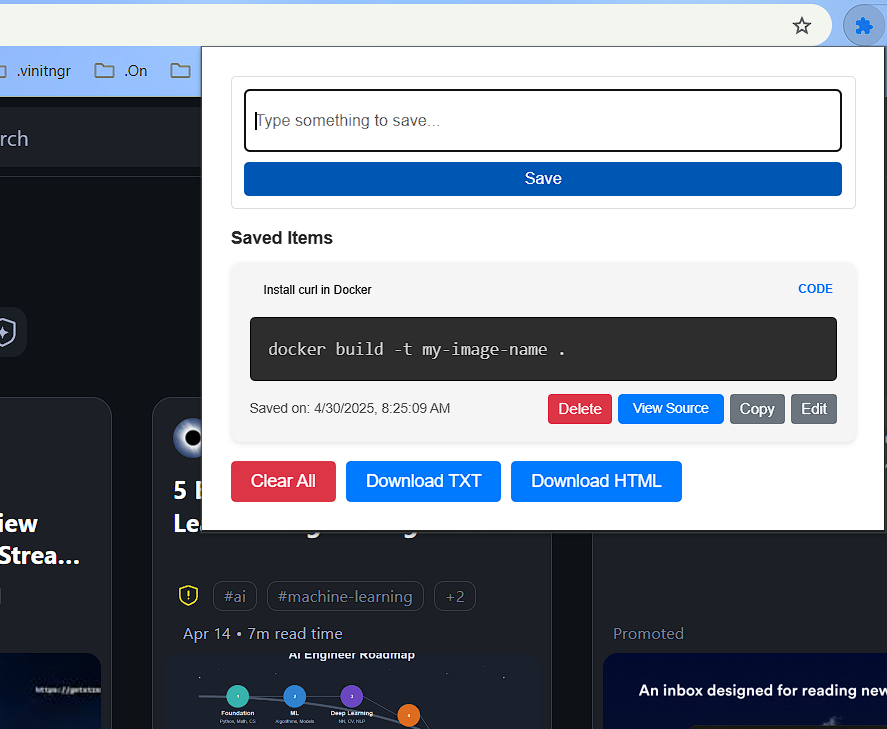
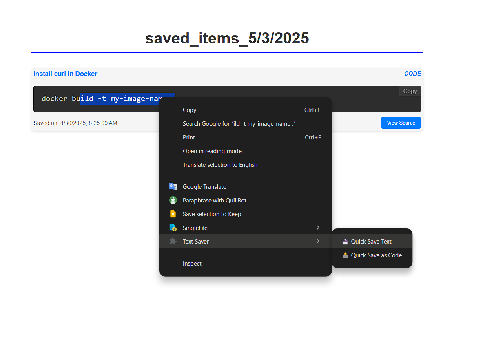

# Chrome Notes Extension

This Chrome extension allows users to select text, right-click, and save it as a note. You can download the saved content in either `.txt` or `.html` format. 

## Features
- Select text and right-click to open a context menu.
- Save text in both **text** and **code block** formats.
- Supports **image integration** alongside text.
- Download saved content as `.txt` or `.html`.

## Installation
1. Download the extension files from this repository.
2. Open Chrome and go to `chrome://extensions/`.
3. Enable "Developer mode" at the top-right.
4. Click "Load unpacked" and select the extension folder.
5. The extension should now be available in your browser.

## Usage
1. **Select text** you want to save.
2. **Right-click** and choose **Text Saver** from the context menu.
3. Choose the format: **Text** or **Code Block**.
4. can integrate images with the saved notes.
5. You can then download the saved content in either `.txt` or `.html` format from popup bar.

